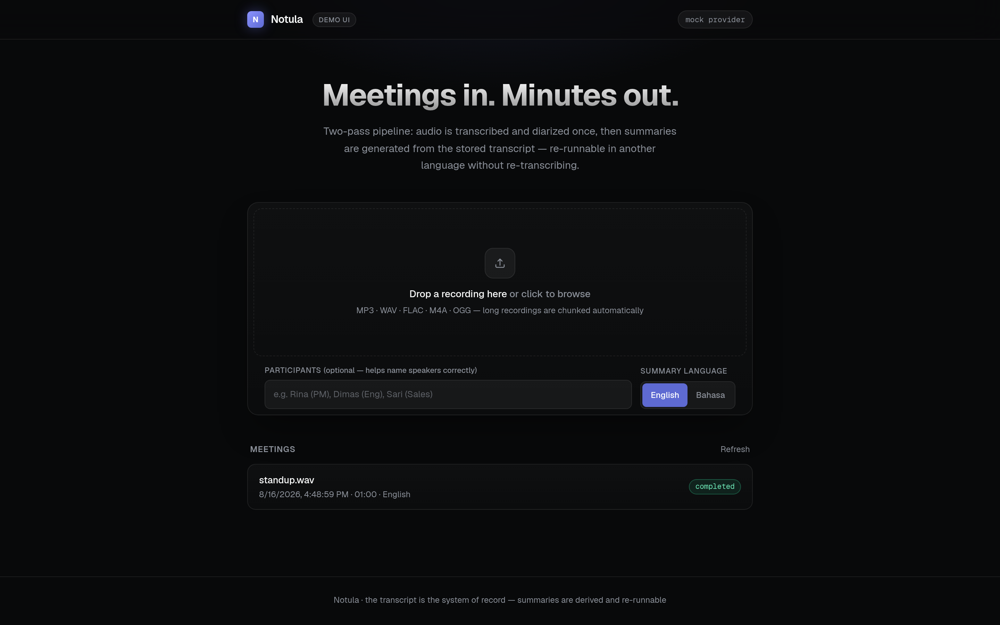
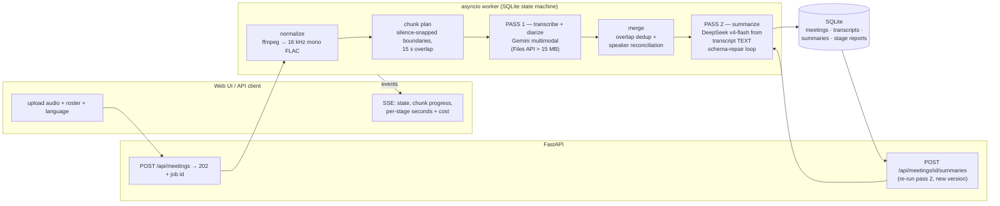
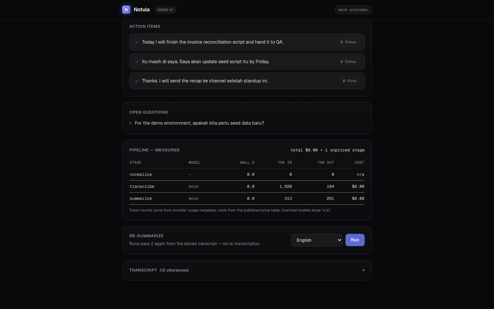
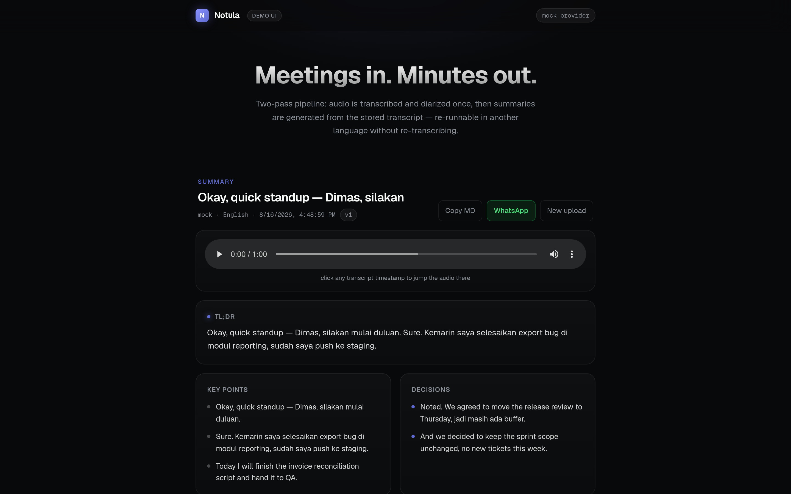

# Notula

**A measured two-pass meeting-notes pipeline: audio in → diarized transcript (system of record) → re-runnable structured summaries — with per-stage latency, token, and cost metering built into the API.**

*Notula* is Indonesian for "meeting minutes." Upload a recording, get a diarized transcript plus a structured summary (TL;DR, decisions, action items with owners, open questions) in English or Bahasa Indonesia — and see exactly what every stage cost.

Most meeting-notetaker repos are desktop apps that assert quality. This one is a reference backend that **measures itself**: every pipeline stage reports wall time, token usage, and cost computed from the provider's own usage metadata; summary quality is scored by an eval suite ([llm-eval-harness](https://github.com/ridwanspace/llm-eval-harness)) rather than claimed.

<p align="center"></p>

## 60-second offline quickstart

No API keys, no Docker, no external services — the default provider is a deterministic mock:

```bash
git clone https://github.com/ridwanspace/notula && cd notula
make install   # uv sync
make demo      # submit bundled sample audio, stream pipeline events, print the summary
make run       # same pipeline behind a web UI at http://localhost:8000
```

`make test` runs lint, mypy --strict, the import-linter architecture contracts, and the unit suite — all offline, with a test fixture that blocks network access outright.

The demo streams the pipeline's SSE events and ends with the measured stage table (mock provider, so costs are $0 and wall times are I/O only):

```
  [  0.14s] state: {'state': 'transcribing'}
  [  0.14s] stage: {'stage': 'transcribe', 'seconds': 0.020, 'cost_usd': 0.0, 'detail': '1 chunk(s), 12 utterances'}
  [  0.14s] state: {'state': 'summarizing'}
  ...
stage         seconds   in tok  out tok   model       cost
normalize        0.00        0        0               n/a
transcribe       0.02     1920      194   mock        $0.000000
summarize        0.01      313      261   mock        $0.000000
```

## How it works



**The transcript is the system of record.** Pass 1 (audio → transcript) is the expensive, slow call; pass 2 (transcript → summary) is cheap text-in/text-out. Storing the transcript makes summaries *re-runnable*: switch the summary language, or improve the prompt, and only pass 2 re-executes — the state machine allows `COMPLETED → SUMMARIZING → COMPLETED`, and a failed re-run keeps the last good summary. Full rationale in [ADR-0003](docs/adr/0003-two-pass-pipeline.md).

**Why two different providers.** Gemini is one of the few APIs that transcribes *and* diarizes audio in a single schema-constrained call. DeepSeek v4-flash is the cheapest capable text model, so it does the re-runnable half. Measured on a real 60-second recording (prices as retrieved 2026-08-16): the whole meeting cost **$0.0050** — $0.0046 to transcribe, $0.0003 to summarize, and an Indonesian re-summary added $0.0003 more *without touching the audio again*.

**Schema repair, not schema hope.** DeepSeek's `json_object` mode enforces JSON but not *your* schema. The parser validates field-by-field with error messages that name the exact offending path (`action_items[2].task must be a non-empty string`), and the repair loop feeds that error plus the failed output back to the model — at most twice, then it fails loudly. Repair attempts are recorded per summary and surfaced in the API and UI. Capability fallbacks (e.g. a provider rejecting `response_format`) trigger only on 4xx errors naming the parameter — never on matching the vendor's prose, and never on 5xx, so an outage is not mistaken for a missing capability ([ADR-0004](docs/adr/0004-offline-mock-and-schema-repair.md)).

**Long audio.** Files over the inline limit go through Gemini's Files API; recordings longer than 20 minutes are split at silence-snapped boundaries with 15-second overlaps, transcribed per chunk, and merged — duplicate utterances in the overlap are dropped at its midpoint, and generic speaker labels ("Speaker 2") are reconciled across chunks by matching utterance text inside the overlap window.

<p align="center"></p>
<p align="center"><em>The measured pipeline table in the demo UI — stage wall time, tokens from provider usage metadata, cost from the price table. Mock provider shown, hence $0.</em></p>

## Measured live runs

One 60-second public council-meeting recording through the live pipeline (`gemini-3.5-flash` + `deepseek-v4-flash`), two separate runs of the identical input:

| stage | run A | run B | tokens (in/out) | cost |
|---|---|---|---|---|
| normalize (ffmpeg) | 0.24 s | 0.09 s | — | — |
| transcribe (Gemini) | 8.7 s | **173.2 s** | 1,617 / 245 | $0.00463 |
| summarize (DeepSeek) | 5.9 s | 8.2 s | 553 / 615–948 | $0.00025–0.00034 |
| re-summarize → Bahasa Indonesia | — | 4.9 s | — | $0.0003 |

The honest observations from those runs, kept rather than tidied:

- **Pass-1 latency varied 20× between runs of the same clip** (8.7 s vs 173.2 s). The 173 s run traced to a stalled-but-established IPv6 connection on the test network — which is also why both provider clients now carry explicit timeouts: before that fix, a stalled connection wedged the worker forever instead of failing the stage.
- **Diarization merged the whole clip into one utterance.** The clip is a single speaker reading a meeting opening; Gemini returned one giant utterance rather than sentence-level segments, which makes timestamp-seek useless on monologues.
- **Proper nouns are unstable across runs:** the same audio yielded speaker "Patrick Therrien" in one run and "Patrick Atary" in another. This is exactly the failure mode the participant-roster feature exists to pin down.
- **Conservatism held:** the recording's opening minute genuinely contains no decisions or commitments, and the live summary correctly returned zero decisions, zero action items, zero open questions — instead of inventing some.
- **The docs' 32-tokens/second audio figure is an estimate, not a bill.** Observed prompt tokens for 60 s of audio plus the instruction text were 1,617 (the naive 32 × 60 = 1,920 for audio alone). The cost meter therefore always bills from the provider's reported usage, never from the estimate.

## Evals

Summary quality is scored, not asserted. `evals/` contains a 5-case golden transcript set (bilingual standup, sprint planning, an Indonesian vendor negotiation, an incident review, and a deliberate **no-decisions** case that exists to catch invented decisions) with two suites:

- `suite.yaml` — offline plumbing run (mock provider; labelled as such because a mock cannot produce meeting summaries — scoring it would be theatre)
- `suite.live.yaml` — the shipped prompt against `deepseek-v4-flash`, gated by JSON-schema validation and LLM-judge faithfulness/relevance

Live result (2026-08-16, `uv run llm-eval run ../evals/suite.live.yaml`, judge = deepseek-v4-flash; run artifact in `evals/runs/live-v1.json`):

| metric | value |
|---|---|
| pass rate | 5/5 cases |
| schema validity | 1.00 |
| faithfulness (judge) | 1.00 |
| relevance (judge) | 1.00 |
| mean latency | 5.9 s |
| total cost | $0.0014 |

The no-decisions case returned empty `decisions`, `action_items`, and `open_questions` — the property under test. Five cases is a starting set, not a benchmark; the interesting use is `llm-eval diff` between prompt versions as the suite grows. Judge choice is part of an eval's definition — a different judge model can flip cases on the identical suite.

## Honest limitations

- **Cross-chunk speaker identity is best-effort.** If a speaker never talks during an overlap window, two chunks cannot prove the identity and the label is renumbered as a new speaker. The merge logic is unit-tested; its limits are documented in `domain/chunking.py`, not hidden.
- **Diarization quality is Gemini's.** Clean 2–3 speaker audio segments well; a monologue came back as one utterance (see measured runs), and heavy crosstalk degrades — this repo does no acoustic diarization of its own.
- **Single-process by design.** SQLite + an in-process asyncio worker with startup recovery, not Postgres + Redis — because the acceptance test is `git clone && make demo` with zero infrastructure. What would change at scale is written down in [ADR-0002](docs/adr/0002-sqlite-and-in-process-worker.md).
- **The mock provider proves the machine, not the model.** Every number produced offline is labelled mock; live numbers come from actually-performed runs with the reproducing command shown.

## Architecture

Layered, with dependencies pointing inward and **import-linter contracts enforced in CI** ([ADR-0001](docs/adr/0001-layered-architecture.md)):

```
presentation (FastAPI, SSE, schemas)   infrastructure (SQLite, ffmpeg, Gemini, DeepSeek, mock)
                    └──────────────┬──────────────┘
                             application (use cases, ports, repair loop)
                                   │
                             domain (stdlib-only: state machine, chunk planning/merging,
                                     cost model, strict parsers)
```

The domain layer imports nothing but the standard library — no Pydantic, no SDKs — and carries a 100% unit-coverage gate in CI (domain + application, branch coverage). Vendor SDKs are quarantined in `infrastructure/providers/`; swapping the summarizer is one adapter.

<p align="center"></p>
<p align="center"><em>Result view: TL;DR, key points, decisions, action items with owner chips, synced audio player. Mock-provider output shown.</em></p>

## Development

```bash
make help          # all targets
make test          # lint + mypy --strict + architecture contracts + unit tests
make coverage      # 100% gate on domain + application
make integration   # full-stack tests over real HTTP + SQLite (still offline)
make eval          # offline eval suite
```

Live mode: copy `.env.example` to `.env`, add `GEMINI_API_KEY` and `DEEPSEEK_API_KEY`, then `NOTULA_PROVIDER=live make run` (or `uv run python scripts/demo.py --live`).

## Roadmap

- [ ] Next.js 16 frontend (SSE streaming UI, generated API types via openapi-typescript) — the static demo page is deliberately zero-toolchain
- [ ] Meeting-bot capture (Zoom/Meet) and digest delivery
- [ ] `llm-eval diff` gate in CI once the golden set is large enough to be meaningful

## License

MIT — Muhammad Ridwan
